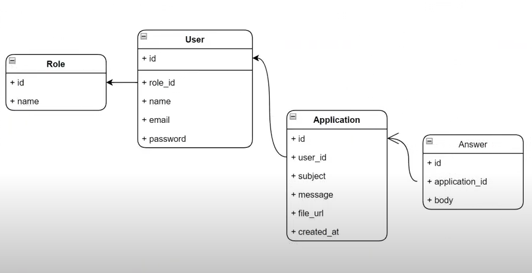

<p align="center"><a href="https://laravel.com" target="_blank"></a></p>

<p align="center">
<a href="https://github.com/laravel/framework/actions"></a>
<a href="https://packagist.org/packages/laravel/framework"></a>
<a href="https://packagist.org/packages/laravel/framework"></a>
<a href="https://packagist.org/packages/laravel/framework"></a>
</p>

## Proyekt haqida
manager va client o'rtasida savol javoblar qilish uchun test proyekt bu.\
client bir kunda bir marta ariza jo'natishi mumkin va u barcha arizalarini va ariza javoblarini ko'ra oladi.\
manager barcha clientlardan kelgan arizalarga javob berishi va edity qilishi mumkin javobini.\
Bu loyiha Laravelni o'rganish davrida qilindi.

## O'rganganlarim

- security(Laravel Breeze)
- Authentication(create Role)
- Authorization(
  grant permission to the role)
- Send email to Laravel.log
- Database connection
- Eloquent ORM
- CRUD
## Baza strukturasi


## Proyektni o'rnatish
```
composer install
```
```
npm install
```
```
php artisan key:generate
```
```
npm run dev
```
```
php artisan queue:work
```
### .env
* MAIL_MAILER=log
### Foydalanuvchilar
proyektga kirganda login page ochiladi\
default kirish uchun ikkita account mavjud
- Role: manager\
user: manage@company.com\
password: access
 
- Role: client\
  user: client@company.com\
  password: access


